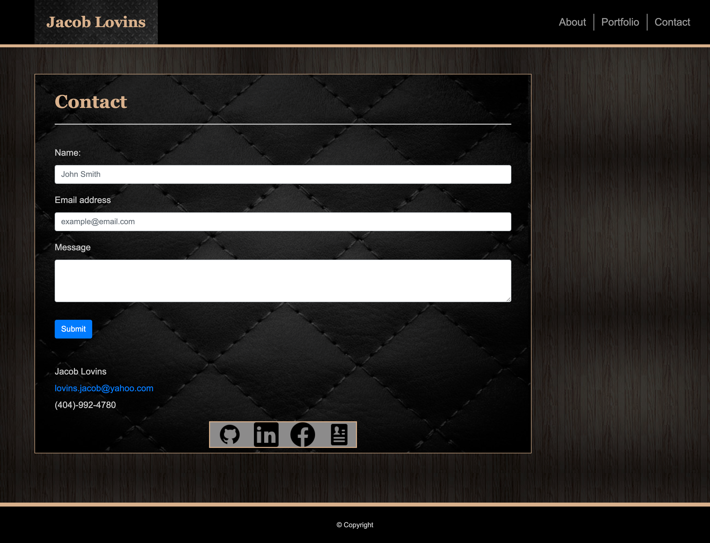

# My Portfolio
This is my responsive portfolio. It transitions smoothly for all screen sizes and gives info on what projects I've worked on and am currently working on, along with some pictures of myself, my projects, and a page where you can contact me via email. This website utilizes bootstrap grids, containers, and many more components for responsiveness and the HTML and CSS has been validated through validation services.

[Click Here to check it out!](https://jacoblovins.github.io/my_portfolio/)

